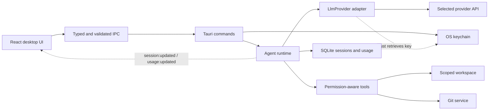

# JevCode

A local desktop AI coding agent built with Tauri 2, React, TypeScript, Vite,
Tailwind CSS and Rust. The project starts from a modular, read-only agent
foundation: open a project, choose a provider, send a message, inspect tool
activity, approve a tool when requested, and resume saved conversations.

The original repository contained only this README and a license. No incumbent
application or architecture was replaced. The initial architecture scope puts
orchestration, credentials, provider requests and local services in Rust, with
React responsible for interaction and presentation.

## Development

Prerequisites: Node.js 22+, a current stable Rust toolchain, Git, and the
[Tauri system prerequisites](https://v2.tauri.app/start/prerequisites/).
On Windows these include Visual Studio C++ Build Tools and WebView2. Linux needs
the documented WebKitGTK/system packages; its credential store uses Secret Service.

```sh
npm ci
npm run tauri dev
```

`tauri dev` starts Vite on `127.0.0.1:1420`, compiles Rust, and opens the desktop
window. In a debug build the source repository opens automatically on the first
launch. Release builds start with an empty workspace. Use **Open folder** to add
other projects. If port 1420 is occupied, close the existing JevCode dev server;
Vite uses a fixed port so the desktop window cannot silently load the wrong app.

**Local preview** runs a deterministic adapter with real project tools and no
remote model. Try **Explore this project**, **Explain the architecture**, or
**Review Git status**. Git status asks for one-time approval by default. Preview
responses are labeled and report zero LLM tokens.

For a remote model, open **Providers**, save an API key to the OS keychain, then
start a new session and select that provider and model. A saved key indicates
presence; account access and model availability are checked on the first request.
Keys are never stored in SQLite, config files, localStorage or logs. The typed
password field holds a key briefly while saving it; Rust alone retrieves stored
credentials. Existing conversations keep their original provider and model.

`npm run dev` opens the UI in a browser for layout work. Browser mode displays
provider metadata and disables native agent actions; it does not simulate a
successful provider request or expose a separate backend web server.

## Module boundaries

| Responsibility | Location | Boundary |
| --- | --- | --- |
| Desktop UI | `src/app`, `src/components`, `src/features` | Presentation, selection, draft messages, event reducer |
| Typed IPC | `src/lib/ipc.ts`, `src/lib/schemas.ts` | Command map, runtime validation, normalized errors |
| Tauri commands | `src-tauri/src/commands` | Validate input and delegate; no provider wire formats |
| Agent runtime | `src-tauri/src/agent` | Bounded tool loop, cancellation, checkpoints, approvals |
| LLM adapters | `src-tauri/src/providers` | `LlmProvider` trait; protocol encoding and normalization |
| Tool execution | `src-tauri/src/tools` | Registry, session policy checks, scoped execution |
| Workspace/project management | `src-tauri/src/workspaces` | Canonical folder identities, local workspace, path checks |
| Git operations | `src-tauri/src/git` | Fixed Git CLI arguments, no shell, timeout, read-only status |
| Persistence | `src-tauri/src/persistence` | SQLite WAL, schema version, session/project/usage storage |
| Authentication/credentials | `src-tauri/src/credentials` | Native OS keychain through `keyring` |
| Usage tracking | `src-tauri/src/usage`, `src/features/usage` | Provider-reported tokens and request duration |



The runtime depends on the `LlmProvider` trait, which accepts normalized
`ProviderRequest` values and returns `ProviderResponse` values. It does not switch
on provider IDs. The adapter factory chooses a wire protocol from configuration.
OpenAI Responses, OpenAI-compatible Chat Completions, Anthropic Messages and
Gemini GenerateContent encode tool definitions and normalize text, calls and usage.
Opaque continuation blocks preserve Responses reasoning items, Anthropic content
blocks and Gemini thought signatures. React never interprets these blocks.

All core interfaces are in `src/types/domain.ts` and `src-tauri/src/domain.rs`:
`Provider`, `Model`, `AgentSession`, `AgentMessage`, `Tool`, `ToolCall`, `ToolResult`,
`Workspace`, `Project`, `UsageRecord`, and `PermissionPolicy`. Rust serializes
camelCase object fields and snake_case enum values. Zod validates command results
and events before they enter React state. Both languages roundtrip the same
session fixture under `tests/fixtures/session.json` to catch contract drift.

`send_message` reserves a session, persists the user message, and starts an async
run without blocking IPC. Checkpoints emit full session snapshots. The frontend
merges snapshots by their update timestamp so an older command response cannot
overwrite a newer event. Multiple sessions can run independently; one session
cannot have competing runs. Provider requests are non-streaming in this version.

## Provider configuration

The catalog in `src-tauri/src/providers/defaults.json` includes:

| Provider | Protocol | Default model |
| --- | --- | --- |
| Local preview | In-process deterministic adapter | Workspace explorer |
| OpenAI | Responses | `gpt-5.4-mini` |
| Anthropic | Messages | `claude-sonnet-4-6` |
| Google Gemini | GenerateContent | `gemini-2.5-flash` |
| OpenCode Zen | OpenAI-compatible Chat Completions | `deepseek-v4-flash` |
| OpenCode Go | OpenAI-compatible Chat Completions | `deepseek-v4-flash` |

These are editable starter entries, not a live entitlement catalog. Models and
provider access can change. Zen and Go are separate configured providers using
their [documented endpoints](https://opencode.ai/docs/zen/) and
[Go endpoints](https://opencode.ai/docs/go/). A gateway model requiring a different
protocol should be registered as a separate provider descriptor with that protocol.

Rust loads `<app_config_dir>/config.json` on startup, falling back to the checked-in
catalog only when the file is absent. Invalid configuration produces a startup
error rather than silently discarding settings. Copy `defaults.json` there and
edit it to add models or providers. IDs must be unique; base URLs must use HTTPS,
without embedded credentials, query strings or fragments. Redirects are disabled.
`maxToolRounds` must be between 1 and 32.

Example additional provider:

```json
{
  "id": "my-gateway",
  "name": "My gateway",
  "protocol": "open_ai_chat",
  "baseUrl": "https://gateway.example.com/v1",
  "models": [{
    "id": "coding-model",
    "providerId": "my-gateway",
    "name": "Coding model",
    "supportsTools": true,
    "contextWindow": null
  }]
}
```

For a new provider using an existing protocol, add configuration only. For a new
wire protocol, implement `LlmProvider`, register its factory and add serialization
fixtures. The UI and agent loop stay unchanged. Credentials are keyed by provider
ID and service `dev.jevcode.desktop`.

Protocol references: [OpenAI function calling](https://developers.openai.com/api/docs/guides/function-calling),
[Anthropic tool results](https://platform.claude.com/docs/en/agents-and-tools/tool-use/handle-tool-calls),
and [Gemini GenerateContent](https://ai.google.dev/api/generate-content).

## Local storage, permissions and errors

Tauri resolves the OS-specific app data, config and log directories. On Windows,
data/config live under `%APPDATA%/dev.jevcode.desktop`; logs live under
`%LOCALAPPDATA%/dev.jevcode.desktop/logs`. `jevcode.sqlite` stores projects, complete
session snapshots and usage records; WAL mode, foreign keys and a busy timeout
are enabled. `schema.sql` owns schema version 1. Add explicit migration steps
before changing the schema in a future release. Conversation and project content
are local plaintext; keys are separately protected by the OS keychain.

The policy has `allow`, `ask` and `deny` decisions for file reads, Git, writes and
shell tools. The backend enforces it, including on resumed approvals. `ask` stores
the pending call and remaining queue, persists `awaiting_permission`, and requires
a matching tool-call ID to resume. Approval authorizes one call and never overrides
`deny`. Denial returns an error tool result to the model. Cancellation closes
unresolved calls with error results so future messages keep valid provider history.
Interrupted running sessions become failed on restart; pending approvals survive.

The only registered tools are `list_files`, `read_file` and `git_status`. File paths
are canonicalized and must stay inside the selected project. Traversal, absolute
paths and symlink/junction escapes are rejected. `.env*`, `.git`, `.aws`, `.ssh`,
`.codex`, `node_modules` and `target` are excluded from file tools. This is a
read-only application guard, not an adversarial filesystem sandbox: files renamed
concurrently with a read are not protected by OS handle-based isolation, and custom
secret filenames are not automatically detected. Reads are UTF-8 and limited to
64 KiB; directory listings to 250 visible entries. Git status uses fixed arguments,
optional locks disabled, no shell interpolation, and a ten-second timeout.

Remote requests have a 15-second connection and 120-second total timeout, a 4 MiB
response limit, and at most 16 tool calls per response. No automatic request retries
are made, avoiding duplicate billed calls. The session round limit bounds provider
iterations across approval pauses. Provider tokens and elapsed request time are
recorded on successful responses. Preview reports zero tokens. Cost stays `null`
until an explicit pricing source is implemented; failed requests may still be
billed remotely and are not represented in these successful-response totals.

Rust returns structured `{ code, message }` errors across IPC. A React error
boundary offers reload recovery; operation errors provide actionable inline copy.
`tracing` writes daily JSONL logs with timestamps, service errors and event names.
Frontend logging sends sanitized identifiers only. Request/response bodies, prompts,
tool content and API keys are not logged. `RUST_LOG=jevcode_lib=debug` changes verbosity.
Logs currently need manual retention management.

The webview CSP permits local assets and Tauri IPC. Tauri capability grants allow
core events and a folder dialog. Provider networking, filesystem access, Git and
credential retrieval stay in Rust; general filesystem/shell plugins are not exposed
to JavaScript. shadcn/ui is optional; this small foundation uses semantic native
controls and Lucide icons without introducing a component framework dependency.

## Validation and build

```sh
npm run lint
npm run typecheck
npm test
npm run rust:check
npm run rust:test
npm run rust:lint
npm run build
npm run tauri build
```

`npm run check` runs lint, TypeScript, frontend tests, Rust checks and Rust tests.
Rust tests cover persistence, path scoping, permission enforcement, real preview
tool runs, provider normalization and the shared TypeScript fixture. Frontend tests
cover IPC schemas, stale-event protection and error redaction. The approved design
reference is in `docs/desktop-mockup.png`; it is not shipped as interface pixels.

This foundation intentionally leaves file editing, arbitrary shell execution,
streamed token deltas, OAuth, live model discovery, context compaction, pricing
sync and signed/updatable release packaging for later features. Remote adapters
are covered by offline protocol fixtures; live API calls require user credentials
and have not been certified against every provider account or model.
