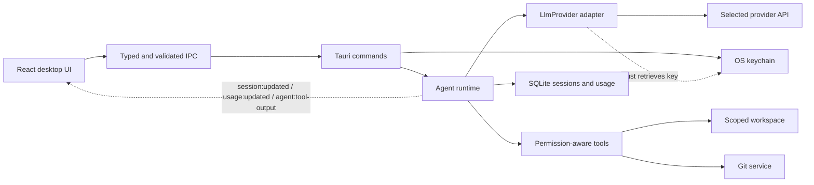

# JevCode

A local desktop AI coding agent built with Tauri 2, React, TypeScript, Vite,
Tailwind CSS and Rust. The project starts from a modular agent foundation: open a
project, choose a provider, send a message, inspect tool activity, approve a tool
when requested, and resume saved conversations.

The original repository contained only this README and a license. No incumbent
application or architecture was replaced. The initial architecture scope puts
orchestration, credentials, provider requests and local services in Rust, with
React responsible for interaction and presentation.

## Development

Prerequisites: Node.js 22+, a current stable Rust toolchain, Git, and the
[Tauri system prerequisites](https://v2.tauri.app/start/prerequisites/).
On Windows these include Visual Studio C++ Build Tools and WebView2. Linux needs
the documented WebKitGTK/system packages; its credential store uses Secret Service.

```sh
npm ci
npm run tauri dev
```

`tauri dev` starts Vite on `127.0.0.1:1420`, compiles Rust, and opens the desktop
window. In a debug build the source repository opens automatically on the first
launch. Release builds start with an empty workspace. Use **Open folder** to add
other projects. If port 1420 is occupied, close the existing JevCode dev server;
Vite uses a fixed port so the desktop window cannot silently load the wrong app.

**Local preview** runs a deterministic adapter with real project tools and no
remote model. Try **Explore this project**, **Explain the architecture**, or
**Review Git status**. Git status asks for one-time approval by default. Preview
responses are labeled and report zero LLM tokens.

For a remote model, open **Providers**, save an API key to the OS keychain, then
start a new session and select that provider and model. A saved key indicates
presence; account access and model availability are checked on the first request.
Keys are never stored in SQLite, config files, localStorage or logs. The typed
password field holds a key briefly while saving it; Rust alone retrieves stored
credentials. Existing conversations keep their original provider and model.

`npm run dev` opens the UI in a browser for layout work. Browser mode shows a
clearly labeled sample project, task, activity, diff, and terminal output so the
workspace can be reviewed without connecting a provider. Sample actions are not
executed, and local-project, credential, and send controls require the desktop app.

## Workspace interface

The main window uses a project and task sidebar, an agent activity timeline, a
task composer, and an optional right inspector for files, diffs, terminal activity,
context, and task details. The sidebar and inspector resize from their dividers;
the sidebar collapses to an icon rail. On narrower windows, the inspector and
sidebar become drawers so the conversation stays usable. The layout has been
reviewed at 1280×850, 900×640, and 618×708 browser viewports.

Use **Ctrl+K** to search projects, tasks, and commands, **Ctrl+N** to start a task,
and **Ctrl+B** to collapse the sidebar. Enter sends a task and Shift+Enter adds a
line. The composer includes project-local file references, project context, a
model selector, and Agent / Plan first modes. Selected files are limited to the
open project; the task receives their relative paths for the existing read tool.
The inspector reports empty states in native sessions when that capability is not
available. Browser preview labels every illustrative activity and diff as sample
data.

## Projects and workspaces

Choose **Open folder** to open an existing directory (including a Git repository),
or **Create project** to make a new child folder under a selected parent. Project
roots are canonicalized in Rust and are the only handles the webview keeps; the
webview cannot read arbitrary paths. Typed commands expose project operations by
project ID, and directory reads by a project ID plus a relative path. Rust checks
containment and rejects traversal, links that escape the root, and protected
directories before reading. The file tree fetches one directory at a time, honors
Git ignore rules, and caps each listing. Project summaries use a bounded scan and
report when their repository size and language counts are partial.

The overview displays the current branch, Git working-tree state and changed
files, recent tasks, approximate repository size, detected languages, and editable
project instructions. Project IDs, canonical paths, instructions, preferred model,
permission defaults, Git root, last-opened time, and recent status are stored in
SQLite. Reopening a recent project validates its current folder and refreshes its
Git metadata. Removing a project from recents leaves its saved sessions intact.
**Reveal** opens the folder in Explorer, Finder, or the system file manager.

The overview's terminal runs a command entered directly by the user in the selected
project folder. It has an output limit and timeout. This one-shot command surface
is not registered as an agent tool. Agent tools continue to use the backend's
separate permission policy and scoped operations. Git branch switching only accepts
an existing local branch name and uses Git arguments without shell interpolation.

## Module boundaries

| Responsibility | Location | Boundary |
| --- | --- | --- |
| Desktop UI | `src/app`, `src/components`, `src/features` | Presentation, selection, draft messages, event reducer |
| Typed IPC | `src/lib/ipc.ts`, `src/lib/schemas.ts` | Command map, runtime validation, normalized errors |
| Tauri commands | `src-tauri/src/commands` | Validate input and delegate; no provider wire formats |
| Agent runtime | `src-tauri/src/agent` | Bounded tool loop, cancellation, checkpoints, approvals |
| Permissions | `src-tauri/src/permissions.rs` | Mode evaluation, command risk checks, one-time/session/project grants |
| LLM adapters | `src-tauri/src/providers` | `LlmProvider` trait; protocol encoding and normalization |
| Tool execution | `src-tauri/src/tools` | Registry, schema validation, scoped and bounded execution |
| Workspace/project management | `src-tauri/src/workspaces` | Canonical folder identities, local workspace, path checks |
| Git operations | `src-tauri/src/git` | Fixed Git CLI arguments, no shell interpolation, bounded status and local branch switching |
| Persistence | `src-tauri/src/persistence` | SQLite WAL, schema version, session/project/usage storage |
| Authentication/credentials | `src-tauri/src/credentials` | Native OS keychain through `keyring` |
| Usage tracking | `src-tauri/src/usage`, `src/features/usage` | Provider-reported tokens and request duration |



The provider-neutral `AgentRuntime` owns the task state machine, context budgeting,
request retries and timeouts, tool-call limits, permission pauses, cancellation,
and scheduling. `LlmProvider` accepts normalized `ProviderRequest` values and
streams visible text while returning normalized tool calls and usage. The adapter
factory chooses a wire protocol from configuration. OpenAI Responses,
OpenAI-compatible Chat Completions, Anthropic Messages and Gemini GenerateContent
encode tool definitions and normalize their responses. Provider continuation data
is sanitized before persistence: hidden reasoning and thinking blocks are neither
displayed nor stored. Only useful task activity such as concise progress, inspected
files, and tool outcomes is exposed to the UI.

All core interfaces are in `src/types/domain.ts` and `src-tauri/src/domain.rs`:
`Provider`, `Model`, `AgentSession`, `AgentMessage`, `Tool`, `ToolCall`, `ToolResult`,
`Workspace`, `Project`, `UsageRecord`, and `PermissionPolicy`. Rust serializes
camelCase object fields and snake_case enum values. Zod validates command results
and events before they enter React state. Both languages roundtrip the same
session fixture under `tests/fixtures/session.json` to catch contract drift.

`send_message` reserves a session, persists the user message, and starts an async
run without blocking IPC. Tasks move through `queued`, `planning`, `working`,
`waiting_for_permission`, `waiting_for_user`, and a terminal state (`completed`,
`failed`, or `cancelled`). Checkpoints persist full conversation and activity
snapshots. The frontend merges snapshots by their update timestamp so an older
command response cannot overwrite a newer event. Text deltas stream as a separate
ephemeral event; the completed assistant message is persisted in the conversation.
Multiple sessions can run independently; one session cannot have competing runs.
Only tools explicitly marked parallel-safe are batched, and permission or user
questions pause the same task until it is resumed. Provider and model selection is
resolved for each task run, so switching does not require restarting the app.

The runtime defaults to 32 model iterations, 64 tool calls, two retries for
transient provider failures, a 120-second model-request timeout, and a 30-second
tool timeout. Its context budget reserves room for the model response and removes
old conversation turns as complete units. The limits and timing values are
configurable through `AgentRuntimeConfig`. `MockProvider` tests exercise streaming,
parallel tools, permission/user pauses, cancellation, persistence, and context
limits without provider credentials or API usage.

## Provider configuration

The catalog in `src-tauri/src/providers/defaults.json` includes:

| Provider | Protocol | Default model |
| --- | --- | --- |
| Local preview | In-process deterministic adapter | Workspace explorer |
| OpenAI | Responses | `gpt-5.4-mini` |
| Anthropic | Messages | `claude-sonnet-4-6` |
| Google Gemini | GenerateContent | `gemini-2.5-flash` |
| OpenCode Zen | OpenAI-compatible Chat Completions | `deepseek-v4-flash` |
| OpenCode Go | OpenAI-compatible Chat Completions | `deepseek-v4-flash` |

These are editable fallback entries for offline setup, not the authoritative
entitlement catalog. When a provider is connected, JevCode retrieves its model
list through that provider's adapter and persists the normalized catalog locally.
Models and provider access can change. Zen and Go are separate configured providers using
their [documented endpoints](https://opencode.ai/docs/zen/) and
[Go endpoints](https://opencode.ai/docs/go/). A gateway model requiring a different
protocol should be registered as a separate provider descriptor with that protocol.

Rust loads `<app_config_dir>/config.json` on startup, falling back to the checked-in
catalog only when the file is absent. Invalid configuration produces a startup
error rather than silently discarding settings. Copy `defaults.json` there and
edit it to add models or providers. IDs must be unique; base URLs must use HTTPS,
without embedded credentials, query strings or fragments. Redirects are disabled.
`maxToolRounds` must be between 1 and 32.

Example additional provider:

```json
{
  "id": "my-gateway",
  "name": "My gateway",
  "protocol": "open_ai_chat",
  "baseUrl": "https://gateway.example.com/v1",
  "models": [{
    "id": "coding-model",
    "provider": "my-gateway",
    "displayName": "Coding model",
    "capabilities": ["tools", "streaming"],
    "supportsTools": true,
    "supportsVision": false,
    "supportsReasoning": false,
    "supportsStreaming": true,
    "contextWindow": null,
    "inputPrice": null,
    "outputPrice": null,
    "status": "available"
  }]
}
```

For a new provider using an existing protocol, add configuration only. For a new
wire protocol, implement `LlmProvider`, register its factory and add serialization
fixtures. The UI and agent loop stay unchanged. Credentials are keyed by provider
ID and service `dev.jevcode.desktop`.

Protocol references: [OpenAI function calling](https://developers.openai.com/api/docs/guides/function-calling),
[Anthropic tool results](https://platform.claude.com/docs/en/agents-and-tools/tool-use/handle-tool-calls),
and [Gemini GenerateContent](https://ai.google.dev/api/generate-content).

## Accounts and provider authentication

The Accounts screen connects OpenAI, Anthropic, Google Gemini, OpenCode Zen and
OpenCode Go independently. Each API key is sent once over typed Tauri IPC to
Rust, checked against the provider's documented model-list endpoint, and saved
only after validation succeeds. Replacing a key with an invalid value leaves the
previous working key intact. The Models action uses the same non-generation
catalog endpoint, so a connection check does not issue a billable model request.

`src-tauri/src/auth` defines the provider-neutral `ProviderAuthAdapter` contract
for connect, disconnect, refresh, validation, account info, model discovery and
status. The current API-key adapter uses bearer authorization for OpenAI and
OpenCode, `x-api-key` for Anthropic, and `x-goog-api-key` for Gemini. Zen and Go
model catalog URLs are taken from their official docs. Account labels and
connection timestamps are safe metadata stored in SQLite; the secret remains
in the OS keychain under service `dev.jevcode.desktop`.

Authentication is intentionally separated by product entitlement:

- OpenAI API keys are supported. OpenAI documents a distinct Sign in with
  ChatGPT flow for eligible open-source clients; JevCode reports that method as
  unavailable until its own adapter and token verification are enabled. It does
  not read Codex credentials or use browser cookies.
- Anthropic Console API keys are supported. JevCode does not reuse Claude Code,
  Claude.ai or subscription OAuth credentials.
- Gemini API keys are supported. Google documents OAuth for Gemini with a
  registered desktop client and Google Cloud project. That method remains gated
  until JevCode has an app client configured.
- OpenCode Zen and OpenCode Go use their respective API keys.

The UI receives no secret on reads: account status, account info and available
models are returned as non-secret types. Secrets are not serialized to SQLite,
localStorage, JSON configuration, source code or logs. Frontend log commands
accept only a small allowlist of fixed event names. Provider response bodies are
never included in errors or logs. Connection failures map to stable categories:
invalid credential, expired authentication, quota exhausted, subscription
unavailable, network error and provider outage.

Official authentication references: [OpenAI API authentication](https://developers.openai.com/api/reference/overview#authentication),
[Sign in with ChatGPT for open-source apps](https://developers.openai.com/siwc/token-sharing-open-source/sign-in),
[Anthropic API authentication](https://platform.claude.com/docs/en/manage-claude/authentication),
[Gemini API keys](https://ai.google.dev/gemini-api/docs/api-key),
[Gemini OAuth](https://ai.google.dev/gemini-api/docs/oauth),
[OpenCode Zen](https://opencode.ai/docs/zen/) and
[OpenCode Go](https://opencode.ai/docs/go/).

## Model management

`Model` is a provider-neutral contract shared by Rust and TypeScript: provider
and model IDs, display name, context window, capabilities, tool/vision/reasoning/
streaming support, optional input/output prices and lifecycle status. Provider
adapters normalize their own catalog responses; the UI does not contain model
names or provider-specific catalog logic. The checked-in catalog supplies only
an initial fallback. Connected providers refresh through their documented model
list endpoint: [OpenAI](https://developers.openai.com/api/reference/resources/models/methods/list),
[Anthropic](https://platform.claude.com/docs/en/api/models/list),
[Gemini](https://ai.google.dev/api/models),
[OpenCode Zen](https://opencode.ai/docs/zen/) and
[OpenCode Go](https://opencode.ai/docs/go/).

The desktop caches normalized catalogs in SQLite `model_catalogs` and preferences
in `model_preferences`; no credentials are stored in either table. Favorites,
recently used models and the workspace default survive restarts. Projects keep a
separate preferred model. The shared picker in the toolbar and composer groups by
provider, supports search and keyboard selection, and shows tool, vision,
reasoning and streaming capability marks. Changing a completed session's model
updates that session in place; the visible conversation is preserved while
opaque provider continuation data is cleared. A running or approval-waiting task
must finish before switching. Removed models are shown as unavailable until the
user selects a current catalog entry; saved defaults fall back to the next valid
project/workspace choice. Catalogs that do not report prices leave prices null.

## Local storage, permissions and errors

Tauri resolves the OS-specific app data, config and log directories. On Windows,
data/config live under `%APPDATA%/dev.jevcode.desktop`; logs live under
`%LOCALAPPDATA%/dev.jevcode.desktop/logs`. `jevcode.sqlite` stores projects, complete
session snapshots, usage records, permission mode and project permission rules;
WAL mode, foreign keys and a busy timeout are enabled. `schema.sql` is version 6,
with in-place migrations for workspace, authentication metadata, model catalogs,
preferences and permissions. Conversation and project content are local plaintext;
provider account metadata contains no secrets, and keys are separately protected
by the OS keychain.

The conservative default is **Ask**. It allows project reads and Git inspection,
and asks before edits, terminal commands, network access, or paths outside the
workspace. **Workspace Write** allows project edits but still asks before commands
and network access. **Full Access** allows ordinary edits, commands and network
requests. Destructive commands, file deletions, credential-like paths,
outside-workspace paths and system-level operations always require fresh
approval. Agent commands cannot elevate privileges. Project settings may ask or
deny more narrowly than the workspace mode.

Approval requests offer **Allow once**, **Allow for this session**, **Always allow
for this project**, and **Deny**. Dangerous actions only offer per-call approval.
Session grants last for the task; project grants are limited to the exact operation
and appear under Settings → Permissions, where each can be revoked. Grants store a
SHA-256 operation fingerprint and a safe display summary, not raw command arguments.
The backend reclassifies every request when it resumes and never trusts a UI-provided
command classification. Denial returns an error tool result to the model. Cancellation
closes unresolved calls with error results so provider history stays valid.
Interrupted running sessions become failed on restart; pending approvals survive.

The Rust tool registry is the only route from model tool calls to project files,
Git, and commands. Each tool descriptor declares a JSON schema, permission
category, risk level, timeout, and whether it is safe to batch with other calls.
The registry rejects unknown fields and invalid arguments before dispatch. Its
structured results include bounded content, pagination metadata, truncation, and
stable error codes; large files, walks, searches, diffs and command output have
explicit limits. Search uses `rg` when installed and falls back to the Rust
ignore-aware walker. Both honor `.gitignore`; credential and build directories
are excluded from search.

File tools include `read_file`, `read_files`, `list_directory`, `search_files`,
`search_text`, and `file_metadata`. Editing is incremental through unique-context
`apply_patch`; `create_file`, `delete_file`, and `move_file` are bounded to regular
files and never recursively delete directories or overwrite move destinations.
Repository context includes `git_status`, `git_diff`, `git_log`, `git_show`,
`git_branch`, `inspect_project`, `find_symbol`, and `find_references`. `run_command`
executes a program with an argument array and a validated working directory; it does
not interpolate through a shell. Stdout and stderr stream into the task timeline
separately and are capped before persistence or model context. Exit status and
timeout details are returned as structured results. Cancelling a task drops the
running child process. Agent-launched processes inherit a small allowlist of
standard environment variables; provider credentials and authentication variables
are filtered out. The command tool has no interactive stdin, so commands that need
user input must run in a user-operated terminal.

Filesystem tool paths are canonicalized and limited to the active project by
default. Outside paths require an explicit grant and remain a fresh-review action
even in Full Access. Command analysis checks for recursive deletion, disk
formatting, privilege elevation, common credential locations, network access and
workspace escapes. Shell interpreters and inline code are classified as dangerous
because their effects cannot be fully inspected statically. This analysis is a
defense-in-depth prompt, not an operating-system sandbox: an approved process runs
with the desktop user's rights. A filesystem guard also cannot prevent a path from
being replaced between validation and use, and custom credential locations may
not be recognized.
Reads are UTF-8 and limited to 64 KiB per file; patches are limited to 1 MiB;
directory pages are capped at 100 visible entries. Git and process execution use
fixed argument arrays, bounded output and per-tool timeouts.

Remote requests have a 15-second connection and 120-second total timeout, a 4 MiB
response limit, and at most 16 tool calls per response. No automatic request retries
are made, avoiding duplicate billed calls. The session round limit bounds provider
iterations across approval pauses. Provider tokens and elapsed request time are
recorded on successful responses. Preview reports zero tokens. Cost stays `null`
until an explicit pricing source is implemented; failed requests may still be
billed remotely and are not represented in these successful-response totals.

Rust returns structured `{ code, message }` errors across IPC. A React error
boundary offers reload recovery; operation errors provide actionable inline copy.
`tracing` writes daily JSONL logs with timestamps, service errors and allowlisted
event names. Frontend logging accepts fixed identifiers only. Request/response bodies, prompts,
tool content and API keys are not logged. `RUST_LOG=jevcode_lib=debug` changes verbosity.
Logs currently need manual retention management.

The webview CSP permits local assets and Tauri IPC. Tauri capability grants allow
core events and a folder dialog. Provider networking, filesystem access, Git and
credential retrieval stay in Rust; general filesystem/shell plugins are not exposed
to JavaScript. shadcn/ui is optional; this small foundation uses semantic native
controls and Lucide icons without introducing a component framework dependency.

## Validation and build

```sh
npm run lint
npm run typecheck
npm test
npm run rust:check
npm run rust:test
npm run rust:lint
npm run build
npm run tauri build
```

`npm run check` runs lint, TypeScript, frontend tests, Rust checks and Rust tests.
Rust tests cover persistence, path scoping, permission enforcement, real preview
tool runs, provider normalization and the shared TypeScript fixture. Frontend tests
cover IPC schemas, stale-event protection and error redaction. The approved design
reference is in `docs/desktop-mockup.png`; it is not shipped as interface pixels.

This foundation intentionally leaves OAuth, context compaction, pricing
sync and signed/updatable release packaging for later features. Remote adapters
are covered by offline protocol fixtures; live API calls require user credentials
and have not been certified against every provider account or model.
